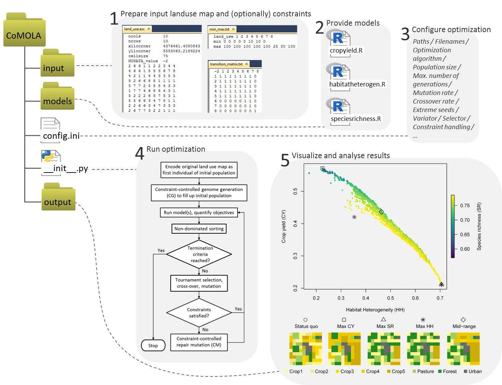
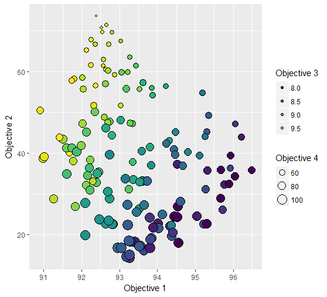

# CoMOLA - Constrained Multi-objective Optimization of Land use Allocation
###### *Michael Strauch and Carola Pätzold*
###### Contact: michael.strauch@ufz.de
###### Main reference: [Strauch et al., 2019](https://doi.org/10.1016/j.envsoft.2019.05.003)

### About
CoMOLA is a free Python tool to optimize the allocation of land use for multiple objectives. It builds upon the open source "inspyred" Python library and includes functions for reading, encoding and writing land use maps as well as genome generation and repair mutation algorithms for considering constraints during the optimization procedure. It runs on Windows and Linux and allows for the integration of any model whose prediction (e.g. a value for an ecosystem service) is based on a land use raster map. In its basic form, CoMOLA can be used immediately by inputting a raster map representing the status-quo land use, ready-to-run models written in R including their input data, and (optional) information on constraints. As constraints, the tool can consider (1) transition rules defining which type of land use can be converted into which other type and (2) minimum and maximum area proportions of each land use type within the study area. All relevant settings, such as paths to input data and models as well as optimization-specific parameters (e.g. population size, crossover and mutation rates) and settings related to constraint-handling and raster map-analysis are managed in one single control file ("config.ini").

The tool was systematically tested for different levels of complexity ([Strauch et al., 2019](https://doi.org/10.1016/j.envsoft.2019.05.003)) and applied for agricultural case studies in the Netherlands (Kromme Rijn, 219 km²) and Central Germany (Lossa, 141 km²) to best reconcile food production, biodiversity and other ecosystem services ([Verhagen et al., 2018](https://doi.org/10.1016/j.envsci.2018.03.013); Kaim et al., under review); it was also applied for optimizing a virtual urban region to foster plant species richness, climate regulation and compactness ([Schwarz et al., 2020](https://doi.org/10.3389/fenvs.2020.00016)).

## Installation requirements

CoMOLA was developed and tested for Python 2.7.

* Required Python packages
  * matplotlib
  * numpy
  * pylab

Furthermore you need to install R to run external models.

## Input
*(see example files in input folder)*

### Maps

__Land use map (required)__

Provide a land use raster map in ascii format (with consecutive integer values representing the different land use classes, starting with value 1). If no user-defined patch ID map is given, CoMOLA generates a patch ID map where neighboring raster cells of the same type are aggregated.

Example *(land\_use.asc)*: <pre>
ncols         10
nrows         10
xllcorner     4376461.4080843
yllcorner     5553063.2189224
cellsize      75
NODATA_value  -2
2 6 6 1 1 2 2 3 4 4
4 6 6 1 5 5 3 6 7 8
4 2 1 1 4 4 3 3 5 5
5 2 6 6 8 8 1 1 1 1
5 7 7 2 5 8 8 4 3 3
1 7 7 4 6 8 8 4 3 1
5 2 2 2 6 8 7 5 3 1
5 5 6 6 3 4 7 5 1 1
2 2 6 6 3 4 7 3 3 3
2 6 7 7 3 2 2 1 1 1</pre>
This example shows a land use map with 8 land use classes distributed over 100 raster cells. For this example map (and the transition matrix given below) CoMOLA would generate a patch ID map with 39 different patches as shown below. 

Automatically generated patch ID map (if not pre-defined by user): <pre>
ncols         10
nrows         10
xllcorner     4376461.4080843
yllcorner     5553063.2189224
cellsize      75
NODATA_value  -2
1 2 2 3 3 4 4 5 6 6 
7 2 2 3 8 8 9 10 11 0 
7 12 3 3 13 13 9 9 14 14 
15 12 16 16 0 0 17 17 17 17 
15 18 18 19 20 0 0 21 22 22 
23 18 18 24 25 0 0 21 22 26 
27 28 28 28 25 0 29 30 22 26 
27 27 31 31 32 33 29 30 26 26 
34 34 31 31 32 33 29 35 35 35 
34 36 37 37 32 38 38 39 39 39</pre>

The patch ID map is then encoded as a string of integers (each value is called a gene, representing the land use of a patch) to form the genome of the start individual, i.e. the first individual of the initial population. 

__Pre-defined patch ID map (optional)__

If appropriate provide your own patch ID map as ascii file to delineate the spatial optimization units as needed in your specific case (with consecutive integer values representing the different patches, starting with value 1). For a cell-level optimization, an individual ID must be assigned to each cell. The spatial resolution must be the same as for the land use map. A value of 0 defines patches with a static land use. Whether a land use class is static or not must be also defined in the transition matrix (see below). Static land use classes will be excluded from the optimization.

Example *(patch\_IDmap\_eachcell\_constraint.asc)*: <pre>
ncols         10
nrows         10
xllcorner     4376461.4080843
yllcorner     5553063.2189224
cellsize      75
NODATA_value  -2
1 2 3 4 5 6 7 8 9 10
11 12 13 14 15 16 17 18 19 0
20 21 22 23 24 25 26 27 28 29
30 31 32 33 0 0 34 35 36 37
38 39 40 41 42 0 0 43 44 45
46 47 48 49 50 0 0 51 52 53
54 55 56 57 58 0 59 60 61 62
63 64 65 66 67 68 69 70 71 72
73 74 75 76 77 78 79 80 81 82
83 84 85 86 87 88 89 90 91 92</pre>
In this example each cell is a patch and subject to optimization, except those cells with value 0 (which is here land use class 8). Be aware, the more patches you include the more complex is the optimization problem and the more computation time is needed. CoMOLA might perform poor if the numbers of patches is too large (>100).

### Constraints

CoMOLA can handle two types of land use change constraints (simultaneously or stand-alone):

__(1) Transition matrix__

A matrix provided as .txt file defining which type of land use (given in rows) can be converted into which other type (given in columns). 1 = transition is possible, 0 = transition is not possible. 

Example *(transition\_matrix.txt)*: <pre>
-2 1 2 3 4 5 6 7 8
1 1 1 1 1 1 1 1 0
2 1 1 1 1 1 1 1 0
3 1 1 1 1 1 1 1 0
4 1 1 1 1 1 1 1 0
5 1 1 1 1 1 1 1 0
6 0 0 0 0 0 1 1 0
7 0 0 0 0 0 0 1 0
8 0 0 0 0 0 0 0 1</pre>
Please note, land use class 8 is defined as static since it cannot be converted into another class, nor can a another class be converted into class 8.

__(2) Total area__

A table provided as .txt file defining minimum and maximum area proportions of each land use type as percentage on total area.

Example *(min\_max.txt)*: <pre>
land_use 1 2 3 4 5 6 7 8
min 0 0 0 0 0 10 10 0
max 100 100 100 100 100 25 30 100</pre>

## External models

CoMOLA handles up to four external models which must be provided as R scripts and stored in separate directories within the models folder (together with their specific input data). Each model evaluates the land use ascii map (as given above) for a specific objective that should be maximized (e.g. a certain ecosystem service). The output of each model is a single value representative for the whole study area (e.g. total agricultural yield) and needs to be written in a .csv file. If the objective value should be minimzed during optimization, multiply the model output with -1.

## Configuration and optimization settings (config.ini)

All relevant settings, such as paths to input data and models as well as optimization-specific parameters and settings related to constraint-handling and raster map-analysis are managed in one single control file called "config.ini". Lines starting with a semicolon (;) are commented out and not used by the algorithm.

config.ini example and description of variables: <pre>
[Dictionary]
; -----------------------------------------
; config\_model 
, Variable                     Description:
; ----------                   ------------
; file\_path\_R                | file path for R
; file\_path\_Python           | file path for Python
; modelx\_folder              | file name of model x folder (1 <= x <= 4)
; file\_modelx                | file name of the model x script
; file\_outputx               | file name of the output file from model x
; update\_filesx              | file names which files of the model folder x 
;                              should be updated in the helping folders
; max\_range                  | maximum number of land use classes
; opt\_algorithm (string)     | definition of the optimization algorithm,
;                              available choices are GA or NSGA2 (default)   
; RPy\_available (string)     | if RPy2 is available than True or False (default) 
; map                        | if True individuals are printed as ascii map files into the
;                              model folders else (default) as vectors in a csv file
; del\_help\_folders           | if True (default) delete and create all helping folders 
;                              each time the tool starts, if False you can alternatively
;                              use the update\_filex entries for updating important files
; -----------------------------------------
; config\_optimization\_algorithm 
, Variable                     Description [default value]:
; ----------                   ------------
; pop\_size                   | number of individuals per generation [100]
; max\_generations            | maximum number of generations [1]
; mutation\_rate              | probability for mutation [0.1]
; crossover\_rate             | probability for cross over [1.0]
; priority                   | land use from NSGA2 candidate is preferred within
;                              repair mutation [True]
; maximize                   | direction of optimization [True] 
; extreme\_seeds              | generate extreme (but feasible) individuals for the first
;                              generation [False]
; max\_repair\_trials          | maximum number of repair trials within repair mutation
;                              [10000]  
; terminator                 | termination criterion, see inspyred docu [default\_termination]
; variator                   | variation method, see inspyred docu [default\_variation]
;                              for constraint-handling and tabu-memory use repair\_mutation
; selector                   | selection method, see inspyred docu [default\_selection]
;                              use constrained\_tournament\_selection as alternative to 
;                              repair\_mutation
;feasible\_first\_pop          | if True create feasible individuals for first population
;                              [False]
;penalty\_function            | 1 or 2 (only for constrained\_tournament\_selection)
;                                1: absolute violation measure
;                                2: normalized violation measure (default)
;plot\_results                | if True plot results into a .png file [False]
; -----------------------------------------
; config\_map\_analysis
; Variable                     Description [default value]:
; ----------                   ------------
; file\_landuse\_map           | file name of land use map [none]
; four\_neighbours            | analysis of four (True) or eight (False) cell neighbours
;                            | to generate patches [False]
; file\_patch\_map             | file name of patch ID map [none]
; file\_transition            | file name of transition matrix [none]
; file\_area                  | file name of total min-max area table [none]
; file\_worst\_fitness         | file name of worst fitness values list [none]

[config\_model]

file\_path\_R = C:/Program Files/R/R-3.3.1/bin/R.exe
file\_path\_Python = C:/Python27/python.exe

model1\_folder = HabStruct
file\_model1 = HabStruct.R
file\_output1 = HabStruct\_output.csv 

model2\_folder = SYM
file\_model2 = SYM.R
file\_output2 = SYM\_output.csv 

model3\_folder = WYLD
file\_model3 = WYLD.R
file\_output3 = WYLD\_output.csv 

;model4\_folder = SAR
;file\_model4 = SAR.R
;file\_output4 = SAR\_output.csv 

max\_range = 8
opt\_algorithm = NSGA2     
RPy2\_available = False
map = True
del\_help\_folders = True

[config\_optimization\_algorithm]

pop\_size = 10 
max\_generations = 2
mutation\_rate = 0.01
crossover\_rate = 0.9
priority = True
maximize = True
extreme\_seeds = False
max\_repair\_trials = 10000

terminator = special\_termination,generation\_termination,diversity\_termination 
variator = n\_point\_crossover, random\_reset\_mutation, repair\_mutation
;variator = n\_point\_crossover, random\_reset\_mutation
;selector = constrained\_tournament\_selection
feasible\_first\_pop = True
;penalty\_function = 2
;plot\_results = True

[config\_map\_analysis]

file\_landuse\_map = land\_use.asc
four\_neighbours = True
;file\_patch\_map = patch\_IDmap\_eachcell\_constraint.asc
file\_transition = transition\_matrix.txt
file\_area = min\_max.txt
file\_worst\_fitness = worst\_fitness\_values\_maximize.txt </pre>

## Running CoMOLA

Copy the whole file structure of CoMOLA to your working directory and run \_\_init\_\_.py from the console: <pre>
python \_\_init\_\_.py </pre>

You can limit the maximum number of threads to be used for parallel computation by adding "-t x" to the command, where x is the maximum number of threads, e.g. <pre>
python \_\_init\_\_.py -t 2 </pre>

## Output

Once CoMOLA has been started, a log file (*Time\_Date\_optimization\_log.txt*) is generated in the *output* folder documenting the process of optimization.

A successful run of CoMOLA will provide the following outputs:
* fitness values for the best solutions (written at the end of the log file and in (*best\_solutions.csv*)
* ascii maps for the best solutions 
* the genome and fitness values of all individuals tested in the optimization (*individuals\_file.csv*)

You may use the R-script (CoMOLA_postprocessing.R) provided in folder *output\_analysis* to extract, evaluate and plot the best solutions.

Example plot:

